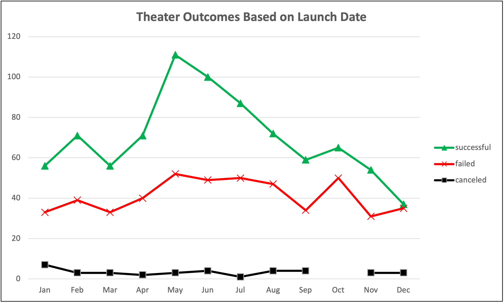
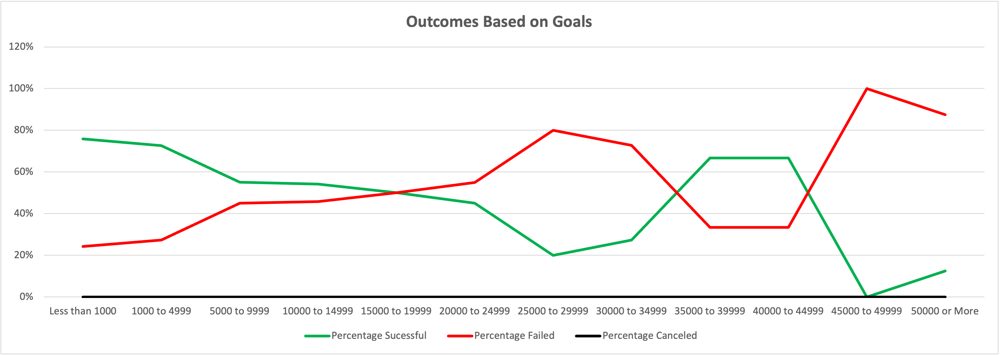

# **POSSIBLE EFFECTS OF LAUNCH DATE AND FUNDING GOAL OVER CAMPAIGNS**

## ***OVERVIEW***

### The purpose of this Analysis is to help Louise have a good picture on how other campaigns behave in relation to their launch dates and the funding goals. This information should help Luoise have a better idea about what could be the best time of the year to launch her play and also the degree of sucess she might have based on her funding goal.

## **ANALYSIS AND CHALLENGES**

### **Analysis of Outcomes Based on Launch Dates**

#### In the image below you can see the outcome of different Theater campaigns by month. In the "Y" axis you will find the number of campaings for the plotted outcome. The green line represents the successful campaigns, the red line represents the failed campaigns and the black line represents the canceled campaigns.

### **Analysis of Outcomes Based on Goals**

#### Below you will find an image showing the outcome for different campaign based on their goals. The "Y" axis shows the percentage of succesful, failed or canceled campaigns and the "X" axis shows the campaign goals segmented in ranges. 12 different ranges were created as can be seen in the image.

### **Challenges and Difficulties Encountered**

#### 1. One of the main challenges that I found was that I was not sure how to organize the data regarding launch dates in order to make it useful for your play, it could be originzed by years, months, weeks or even by days. I realized that displaying the information by month would give you a better send of the time of the year that successful campaigns are launched.

#### 2. The second difficulty was to define the way I was going to present the outcomes based on their goals in order to make it meaningful to you, so thinking about your 12,000 USD funding goal made me think that I needed to split the goals in ranges of 5,000 USD to clearly identify the behavior of the campaigns.

## **RESULTS**

### > From the Outcomes based on Launch Date we can conclude the following: 1) May, June and July are the months with the higher number of successful campaigns so it would make sense to consider the launch date of your play "Fever" around these months. 2) The months with more failed campigns are May, June, July and October, with around 50 failed campaigns. The best combination of succesful vs failed campaigns happens in May, so May sound like a good month for launching your play.

### > From the Outcomes based on Goals we can conclude that the higher number of successful campaigns are those ones within the ranges of less than 1,000 and from 1,000 to 4,999 with more than 70% of successful campaigns vs failed ones. The range where your funding goal of 12,000 is located (from 10,000 to 14,999) has a lower successful rate with 54% but still is over the failed ones.

### > One limitations of this data set is that within the plays subcategory it is not included the genre of the play which would give us a better point of comparison with the specific genre of "Fever". Another limitation I see is that the location of the campagins is limited to Country, if we had information about state or cities, we could make a more precise analysis of a specific place where "Fever" could have a greater success oportunity.

### > Other possible tables or graphs we could create are: a) A comparison of how quickly a campaing was funded by showing the time difference between the launch and the deadlines dates, b) A comparison of outcomes by country to see in which country there are more successful campaigns, c) The average donation per subcategory and country to find in which country we can find more backers with the disposition of spend more money in specific campaigns.

